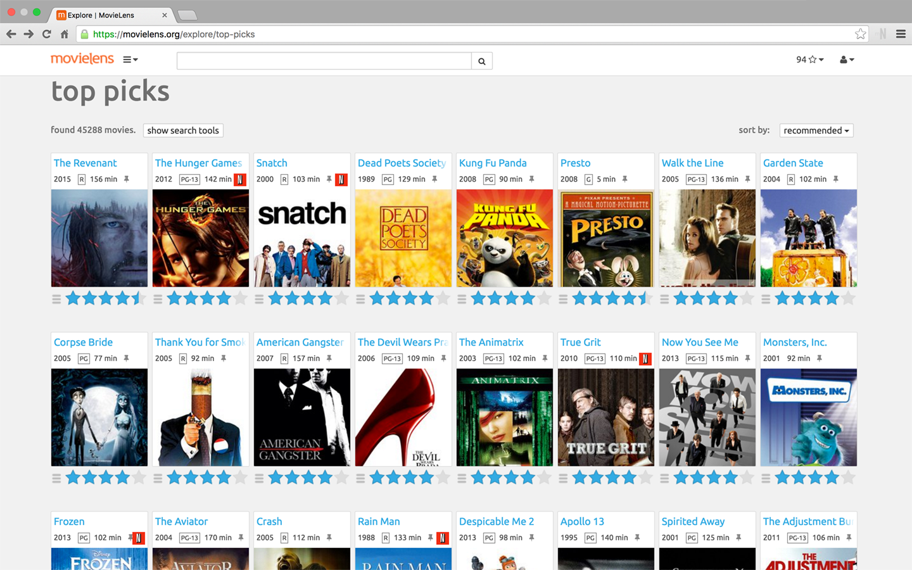

# movielens-netflix-badge
Chrome Extension to show which movies on MovieLens (https://movielens.org/) are available on Netflix.

Kudos to the GroupLens Research for building and amazing recommender system and Andrew Sampson for exposing such a simple Netflix API. 

## Installation
- Download/clone the repo
- Go to chrome://extensions/ in Google Chrome.
- Enable 'Developer mode' and 'Load unpacked extension' selecting the `app` folder

## Screenshot

